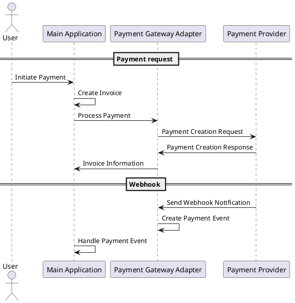

# Laravel Payment Gateway Adapter
This package provides a simple adapter for integrating various payment gateways into Laravel 11 applications. It allows developers to easily switch between different payment providers without changing the core application logic.

The adapter does not store data or state; it simply provides a unified interface for payment operations. All actions will be broadcast via events.

## Procedures
### Primary Flow

